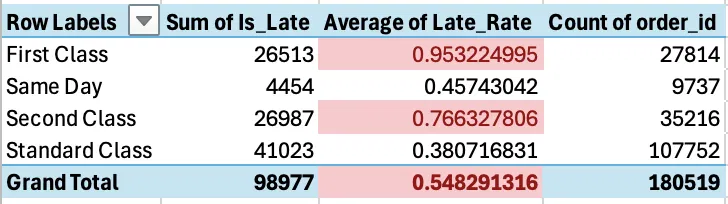
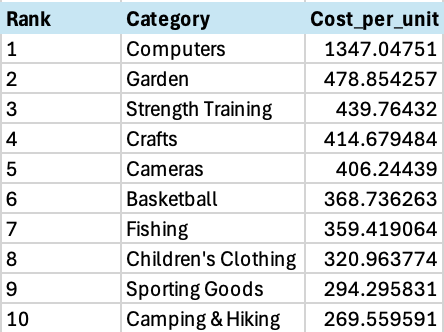
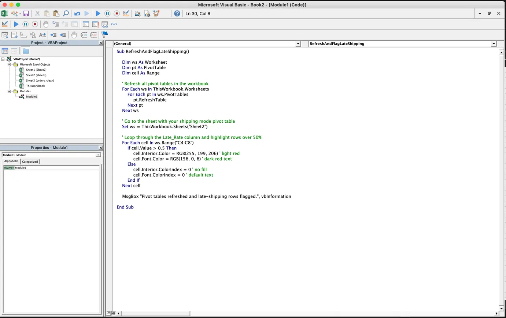
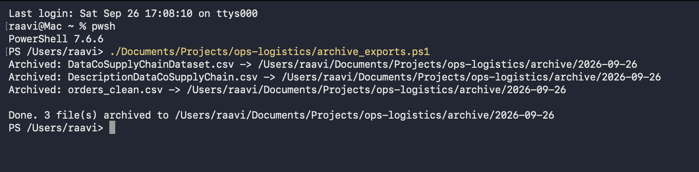

# Ops & Logistics KPI Dashboard

An end-to-end analytics project analyzing ~180,500 real e-commerce order/shipment records to surface on-time delivery, cost-per-unit, and root-cause shipping performance metrics.

**[View the live Tableau dashboard →](https://public.tableau.com/app/profile/somaja.raavi/viz/OpsLogisticsPerformanceDashboard/OpsLogisticsPerformanceDashboard)**

## Overview

This project simulates a real Transportation/Logistics Analyst workflow: pulling raw shipment data into a relational database, cleaning and standardizing it, calculating key operational KPIs, cross-validating those numbers in a second tool, automating a recurring file-handling task, and presenting findings in an interactive dashboard.

**Dataset:** [DataCo Smart Supply Chain for Big Data Analysis](https://www.kaggle.com/datasets/shashwatwork/dataco-smart-supply-chain-for-big-data-analysis) (Kaggle) - ~180,519 order/shipment records across 3 years, 50+ product categories, and 164 countries.

## Tech Stack

- **PostgreSQL** - data loading, cleaning, and KPI queries
- **Excel** (Power Query, Pivot Tables, VBA) - cross-validation and automation
- **PowerShell** - file archiving automation
- **Tableau Public** - dashboard visualization
- **Git/GitHub, Jira** - version control and project tracking

## Key Findings

- **54.83% of all orders arrive late.** More than half of all shipments miss their scheduled delivery window.
- **Lateness is driven by shipping mode, not geography.** First Class shipping has a 95.32% late-delivery rate - the worst of any mode - while Standard Class is the most reliable at 38.07% late. Late-delivery rate barely varies by region (54-58% across every region), ruling out geography as a meaningful factor.
- **Cost per unit varies sharply by category**, from Computers (~$1,347/unit) down to CDs (~$10/unit). A sharp cost-per-unit spike in Oct-Dec 2017 was investigated and traced to a genuine product-mix shift (the catalog shifted from sporting goods to higher-ticket electronics that quarter), not a data error.
- **Discount rates are consistent (~10-11%) across every product category** - discounting isn't what drives cost-per-unit differences; list price is.

## Data Cleaning

- Checked for duplicate records (order_item_id grain) - none found.
- Checked for nulls in delivery-critical fields (order date, shipping date, days for shipping) - none found.
- **Found and fixed a real data quality issue:** order_country and customer_country were recorded entirely in Spanish (166 distinct values, e.g. "Alemania" instead of "Germany"). Built a translation lookup table and added clean English columns via a non-destructive join (original columns preserved).

## Cross-Validation

Every KPI was calculated independently in both PostgreSQL and Excel to confirm accuracy:

On-time delivery by shipping mode (Excel PivotTable, VBA-flagged for >50% late):

Cost per unit by category (Excel, ranked via LARGE + INDEX/MATCH):

Both matched the PostgreSQL SQL output exactly.

## Automation

VBA macro - refreshes all pivot tables and conditionally highlights any shipping mode exceeding a 50% late-delivery threshold:

PowerShell script - archives CSV exports into dated folders, building a running history of data pulls:

## Project Files

- create_table.sql - PostgreSQL table schema
- translate_countries.sql - Spanish-to-English country translation + join
- archive_exports.ps1 - PowerShell file archiving automation
- DescriptionDataCoSupplyChain.csv - data dictionary for the source dataset

Note: the raw dataset CSVs are excluded from this repo (see .gitignore) due to file size - download them directly from the Kaggle source to reproduce.

## Reproducing This Project

1. Download the dataset from Kaggle (link above).
2. Run create_table.sql in PostgreSQL to build the schema, then import the CSV.
3. Run translate_countries.sql to clean the country fields.
4. Export a cleaned CSV and load it into Excel via Power Query, or directly into Tableau Public.
5. Run archive_exports.ps1 via PowerShell Core (pwsh) to archive exports.